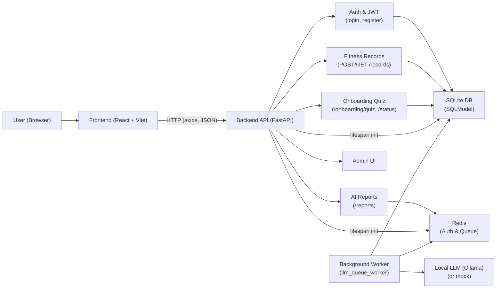

# System Architecture Overview
## Intelligent Fitness Application (Blue Falcons Fitness App)

**Version:** 1.0  
**Related:** [Project Management Plan](project-management-plan.md) | [Requirements Specification](requirements-specification.md)

---

## 1. Purpose

This document describes the high-level architecture of the Blue Falcons Fitness App: components, technologies, data flow, and deployment context. It supports onboarding and maintenance and aligns with the PMP’s documentation plan.

---

## 2. Architecture Summary

The system is a **web application** with:

- A **React (Vite)** single-page frontend for the user interface.
- A **FastAPI** backend providing a REST-style API, authentication, business logic, and integration with the database and optional LLM.
- **SQLite** (async via aiosqlite) as the primary data store, with **SQLModel** for models and migrations (schema create-on-start).
- **Redis** for auth-related state and a **task queue** for asynchronous AI report generation.
- **Ollama** (optional) for local LLM-generated fitness reports; when disabled, a mock report generator is used.

---

## 3. High-Level Components

```
┌─────────────────────────────────────────────────────────────────────────┐
│                           CLIENT (Browser)                               │
│  React + Vite SPA (src/frontend) — routing, pages, future API calls      │
└─────────────────────────────────────────────────────────────────────────┘
                                      │
                                      │ HTTP / REST (JSON)
                                      ▼
┌─────────────────────────────────────────────────────────────────────────┐
│                         BACKEND (FastAPI)                                │
│  main.py — CORS, lifespan, router registration                           │
│  ├── api/          — REST endpoints (login, fitness, report, quiz, admin)│
│  ├── core/         — config, auth (JWT), database, security, health     │
│  ├── crud/         — database operations (user, fitness, quiz)          │
│  ├── model.py      — SQLModel entities                                  │
│  ├── schemas.py    — Pydantic request/response DTOs                     │
│  └── tasks.py      — background worker (consumes Redis queue)            │
└─────────────────────────────────────────────────────────────────────────┘
         │                    │                        │
         │                    │                        │
         ▼                    ▼                        ▼
┌──────────────┐    ┌──────────────────┐    ┌─────────────────────────┐
│   SQLite     │    │      Redis       │    │  Ollama (optional)       │
│  (database)  │    │  Auth + Queue    │    │  Local LLM for reports   │
└──────────────┘    └──────────────────┘    └─────────────────────────┘
```

### 3.1 Component diagram (Mermaid)

In Markdown viewers that support Mermaid (e.g. GitHub, GitLab), the block below renders as a flowchart. **In VS Code** install the recommended extension (Markdown Preview Mermaid Support) when prompted, or add it from the Extensions view so the diagram renders in the Markdown preview.



---

## 4. Backend Structure

### 4.1 Entry Point and Lifespan

- **Entry:** `main.py` runs the FastAPI app with Uvicorn (default: `http://0.0.0.0:8000`).
- **Lifespan** (startup):
  1. Create database tables (SQLModel metadata, SQLite).
  2. Connect to Redis (auth DB and queue DB).
  3. Optionally verify Ollama and bind real LLM report generation; otherwise use mock.
  4. Start the background worker that consumes the report queue.
- **Lifespan** (shutdown): Cancel worker, close Redis connections.

### 4.2 API Layer (`src/api/`)

| Router / Module | Prefix / Path | Purpose |
|-----------------|----------------|---------|
| `login`         | `/api/v1`      | Registration, login (JWT access token). |
| `fitness`       | `/api/v1`      | Create and list fitness records (auth required). |
| `report`        | `/api/v1/reports` | Enqueue AI report generation (auth required). |
| `quiz`          | `/api/v1/onboarding` | Onboarding quiz: submit, get, update; quiz status. |
| Admin (SQLAdmin)| `/admin`       | CRUD UI for User, FitnessRecord, FitnessReport, FitnessGoal. |

Protected routes use the `get_current_user` dependency (JWT from `Authorization: Bearer <token>`).

### 4.3 Core (`src/core/`)

- **config:** Settings from environment (`.env`): JWT, Redis, LLM enable/disable, project name.
- **database:** Async engine (SQLite + aiosqlite), session factory, `get_session` dependency.
- **auth:** JWT create/verify, `get_current_user` dependency.
- **security:** Password hashing and verification (bcrypt).
- **health_calculations:** BMI, BMR (Mifflin–St Jeor), TDEE from quiz inputs (imperial units).
- **llm:** Optional Ollama-based report generation used by the background worker.

### 4.4 Data Layer

- **Models (`src/model.py`):** `User`, `FitnessRecord`, `FitnessReport`, `FitnessGoal` (with `TimestampMixin`). Relationships: User → FitnessRecord(s), User → FitnessReport(s), User → FitnessGoal (one-to-one).
- **CRUD (`src/crud/`):** User (create, get by username/email), fitness records (create, list by user), quiz/FitnessGoal (get/create/update by user).
- **Schemas (`src/schemas.py`):** Pydantic models for request/response validation and serialization (e.g. UserCreate, UserRead, FitnessRecordCreate/Read, QuizSubmit, FitnessGoalRead, Token).

---

## 5. Data Flow (Key Scenarios)

### 5.1 User Registration and Login

1. Client sends `POST /api/v1/register` (username, email, password).
2. Backend hashes password, creates `User`, returns user payload (no token).
3. Client sends `POST /api/v1/login/access-token` (OAuth2 form: username, password).
4. Backend authenticates, returns JWT; client stores token and sends it in `Authorization` for protected calls.

### 5.2 Onboarding Quiz

1. Authenticated user sends `POST /api/v1/onboarding/quiz` with goals, demographics, preferences.
2. Backend computes BMI, BMR, TDEE; creates/updates `FitnessGoal`; returns `FitnessGoalRead`.
3. `GET /api/v1/onboarding/quiz` returns saved goal; `GET /api/v1/onboarding/status` returns completion status.

### 5.3 Fitness Records

1. Authenticated user sends `POST /api/v1/records` with body metrics and goal/activity.
2. Backend creates `FitnessRecord` linked to user.
3. `GET /api/v1/records` returns the user’s recent records (e.g. for dashboard or report input).

### 5.4 AI Report Generation

1. Authenticated user sends `POST /api/v1/reports/generate`.
2. Backend loads user’s recent fitness data, builds a summary, pushes a task payload to a Redis list (queue).
3. Backend responds immediately with “queued” / “pending.”
4. Background worker (in process) pops tasks from Redis, calls LLM (or mock), and persists `FitnessReport` to SQLite. (A future endpoint may expose report history to the client.)

---

## 6. Database Schema (Conceptual)

The persistent store is SQLite. Main entities:

- **users** — id, email, username, password_hash, is_active, created_at, updated_at.
- **fitness_records** — id, user_id (FK), age, gender, height_in, weight_lbs, activity_level, fitness_goal, created_at, updated_at.
- **fitness_reports** — id, user_id (FK), report_content, data_summary, model_used, analysis_start_date, analysis_end_date, created_at, updated_at.
- **fitness_goals** — id, user_id (FK, unique), goal_type, demographics, preferences, bmi, bmr, tdee, quiz_completed, created_at, updated_at.

A detailed entity-relationship diagram is available in the repository: **docs/ERdiagram_sprint1.png**.

---

## 7. External Dependencies

| Dependency | Role | Required |
|------------|------|----------|
| SQLite (file) | Primary database | Yes |
| Redis | Auth state, report task queue | Yes |
| Ollama | Local LLM for report text | No (mock used if disabled) |

---

## 8. Frontend (Overview)

- **Stack:** React 19, Vite 7, React Router.
- **Location:** `src/frontend/`.
- **Current state:** Multi-page shell (Home, Features, About, Login, Sign Up) with routing; API integration (auth, quiz, records, reports) is to be wired in later sprints.

---

## 9. Security Considerations

- Passwords are hashed (bcrypt) and never stored in plain text.
- Protected routes require a valid JWT; `get_current_user` enforces ownership (queries scoped by user id where applicable).
- CORS is configured on the backend (e.g. allow origins as needed for the frontend).
- Admin UI (`/admin`) should be restricted in production (e.g. auth, network, or feature flag).

---

## 10. Deployment Context

- **Development:** Run backend with `python main.py`, frontend with `npm run dev` in `src/frontend`; backend typically on port 8000, frontend on 5173. Redis and optional Ollama run locally (e.g. Docker for Redis).
- **Production:** Not specified in scope; architecture is suitable for a single-server deployment (e.g. reverse proxy in front of FastAPI and static frontend build). Database and Redis would be configured via environment variables.

---

## 11. Document History

| Version | Date       | Author | Changes     |
|---------|------------|--------|-------------|
| 1.0     | 2026-03-07 | Shawn  | Initial draft |
